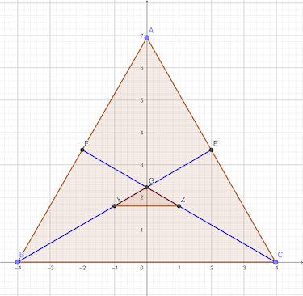
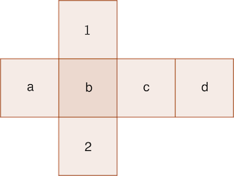
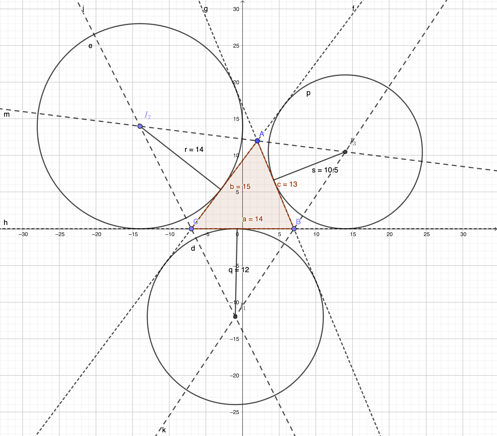
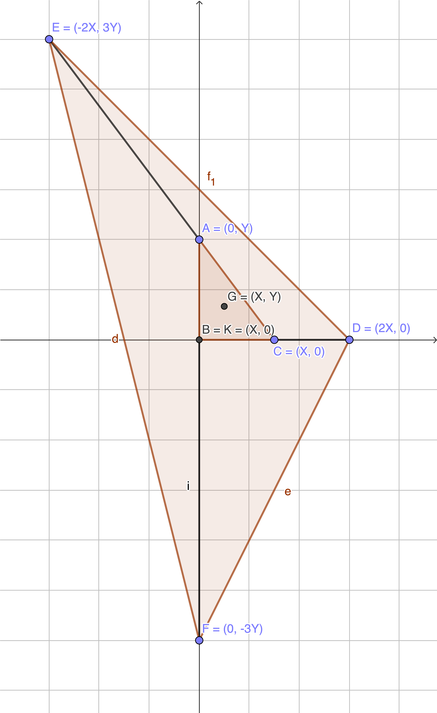
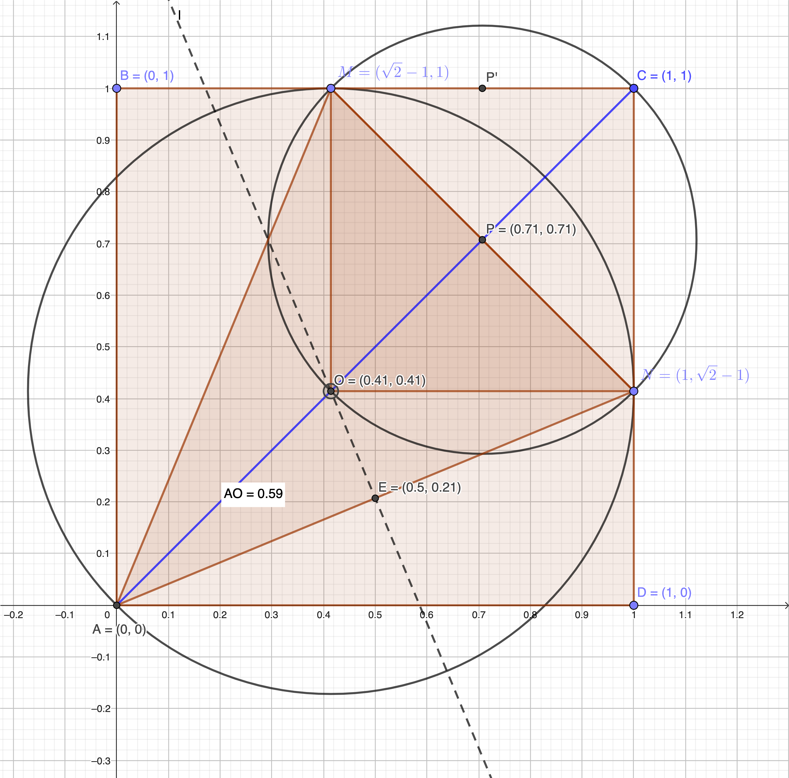
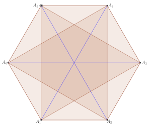

## IOQM 2023 Solutions

1. Let n be a positive integer such that $1\le n\le 1000$. Let $M_n$ be the number of elements in the set $X_n = \{\sqrt{4n+1},\sqrt{4n+2},\cdots,\sqrt{4n+1000} \}$. Let
   $$a=\max\{M_n:1\le n \le 1000\},\text{and }b=\min\{M_n:1\le n \le 1000\}$$

#### ANS:

Find $a-b$
$$b=\lfloor\sqrt{4\times1000+1000}\rfloor-\lfloor\sqrt{4\times1000+1}\rfloor=\lfloor\sqrt{5000}\rfloor-\lfloor\sqrt{4001}\rfloor=70-63=7$$
$$a=\lfloor\sqrt{4\times1+1000}\rfloor-\lfloor\sqrt{4\times1+1}\rfloor=\lfloor\sqrt{1004}\rfloor-\lfloor\sqrt{5}\rfloor=31-2=29$$
$$a-b=29-7=22$$

---

2. Find the number of elements in the set
   $$\{(a, b) \in \N : 2 \le a, b \le 2023, \log_a(b) +6 \log_b(a)=5\}$$

#### ANS:

$$S=\{(a, b) \in \N : 2 \le a, b \le 2023, \log_a(b) +6 \log_b(a)=5\}$$
$$\Rightarrow \log_a(b)+6\log_b(a)=5$$
$$\Rightarrow \log^2(b)+6\log^2(a)=5\log(b)\log(a)$$
$$\Rightarrow \log^2(b)-3\log(b)\log(a)-2\log(b)\log(a)+6\log^2(a)=0$$
$$\Rightarrow \log(b)(\log(b)-3\log(a))-2\log(a)(\log(b)-3\log(a))=0$$
$$\Rightarrow (\log(b)-2\log(a))(\log(b)-3\log(a))=0$$
$$\Rightarrow a^2=b, a^3=b$$
$$S1=\{(a, b): 2 \le a, b \le 2023, a^2=b\} = \{(2,4), (3,9), .... (44,1936)\}$$
$$S2=\{(a, b): 2 \le a, b \le 2023, a^3=b\} = \{(2,8), (3,27), .... (12,1728)\}$$
$$|S|=|S1|+|S2|=(44-1)+(12-1)=56-2=54$$

---

3. Let $\alpha$ and $\beta$ be positive integers such that

$$\frac{16}{37} < \frac{\alpha}{\beta} < \frac{7}{16}$$

Find the smallest possible value of \beta.

#### ANS:

$$\frac{16}{37} < \frac{\alpha}{\beta} < \frac{7}{16}$$
$$\frac{37}{16} > \frac{\beta}{\alpha} > \frac{16}{7}$$
$$2.31 > \frac{\beta}{\alpha} > 2.28$$
$$2.31 > 2.30 > 2.28$$
$$\alpha=10, \beta=23$$

---

4. Let x, y be positive integers such that
   $$x^4=(x-1)(y^3-23)-1$$
   Find the maximum value of x + y
#### ANS:
   $$\text{Let }z=y^3=\frac{x^4+1}{(x-1)}+23$$

   $$\Rightarrow z=(x^3+x^2+x+1)+\frac{2}{x-1}+23$$
   Possible values of x = \{-1,0,2,3\} for which z = \{21, 22,40,64\}

Only 64 is perfect cube, so (x, y) = (3, 4)

So x + y = 7

---
5. In a triangle ABC, let E be the midpoint of AC and F be the midpoint of AB. The medians BE and CF intersect at G. Let Y and Z be the midpoints of BE and CF respectively. If the area of triangle ABC is 480 , find the area of triangle GYZ.
#### ANS:
Let ABC be an equilateral triangle

$$\text{Let } GE=2x \rightarrow BG=4x \rightarrow BE=6x \rightarrow BY=YE=3x \rightarrow YG=BG-BY=x$$

It can be shown that $\Delta GYZ \sim \Delta ABC$

$$\Rightarrow \frac{|\Delta GBC|}{|\Delta GYZ|}=\frac{|GB|}{|GY|}=\frac{4x}{x}=4$$

As $\Delta ABC$ is equilateral $|\Delta GBC|=\frac{|\Delta ABC|}{3}=\frac{480}{3}=160$

$$\Rightarrow \frac{|\Delta GBC|}{|\Delta GYZ|}=\frac{160}{|\Delta GYZ|}=4$$
$$\Rightarrow |\Delta GYZ|=\frac{160}{4}=40$$

---
6. Let X be the set of all even positive integers n such that the measure of the angle of some regular polygon is n degrees. Find the number of elements in X.

#### ANS:

$$360=2^33^25^1$$
$$|factors(360)|=4.3.2=24$$
$$|oddFactors(360)|=3.2=6$$
$$|evenFactors(360)|=3.2=24-6=16$$
$$|X|=16$$
---
7. Unconventional dice are to be designed such that the six faces are marked with numbers from 1 to 6 with 1 and 2 appearing on opposite faces. Further, each face is colored either red or yellow with opposite faces always of the same color. Two dice are considered to have the same design if one of them can be rotated to obtain a dice that has the same numbers and colors on the corresponding faces as the other one. Find the number of distinct dice that can be designed.
   
#### ANS:

number of distinct dice $$= |Colours|\times Permutation(a, b, c, d)=2\times{}_n \mathrm{ P }_k=2\times{}_4 \mathrm{ P }_4=2\times4!=48$$

---
8. Given a $2 \times 2$ tile and seven dominoes ( $2 \times 1$ tile), find the number of ways of tiling (that is, cover without leaving gaps and without overlapping of any two tiles) a $2 \times 7$ rectangle using some of these tiles.

#### ANS:
---
9. Find the number of triples (a, b, c) of positive integers such that

   * ab is a prime;
   * bc is a product of two primes; 
   * abc is not divisible by square of any prime and
   * $abc \leq 30.$

#### ANS:

|  # 	| a 	|  b 	|  c 	| abc 	|
|:--:	|:-:	|:--:	|:--:	|:---:	|
|  1 	| 1 	|  2 	|  3 	|  6  	|
|  2 	| 1 	|  2 	|  5 	|  10 	|
|  3 	| 1 	|  2 	|  7 	|  14 	|
|  4 	| 1 	|  2 	| 11 	|  22 	|
|  5 	| 1 	|  2 	| 13 	|  26 	|
|  6 	| 1 	|  3 	|  2 	|  6  	|
|  7 	| 1 	|  3 	|  5 	|  15 	|
|  8 	| 1 	|  3 	|  7 	|  21 	|
|  9 	| 1 	|  5 	|  2 	|  10 	|
| 10 	| 1 	|  5 	|  3 	|  15 	|
| 11 	| 1 	|  7 	|  2 	|  14 	|
| 12 	| 1 	|  7 	|  3 	|  21 	|
| 13 	| 1 	| 11 	|  2 	|  22 	|
| 14 	| 1 	| 13 	|  2 	|  26 	|
| 15 	| 2 	|  1 	|  6 	|  12 	|
| 16 	| 2 	|  1 	| 10 	|  20 	|
| 17 	| 3 	|  1 	|  6 	|  18 	|

---
10.  The sequence $\left\langle a_n\right\rangle_{n \geq 0}$ is defined by $a_0=1, a_1=-4 \text{ and } a_{n+2}=-4 a_{n+1}-7 a_n, \text{ for } n \geq 0$. Find the number of positive integer divisors of $a_{50}^2-a_{49} a_{51}$.

#### ANS:

$$\{1, -4, 9, -8, -31, ....\}$$
$$a_{n+1}^2-a_{n} a_{n+2}=\{?,?,7,49,343,\ldots\}$$
$$a_{n+1}^2-a_{n} a_{n+2}=7^{n+1}$$
$$a_{50}^2-a_{49} a_{51}=7^{50}$$

Number of positive integer divisors = 51

---
11. A positive integer $m$ has the property that $m^2$ is expressed in the format $4n^2-5n+16$ where n is an integer.Find the maximum possible value of |m-n|.

#### ANS:

$$\Rightarrow m^2=4n^2-5n+16=(2n)^2-2.5.2.\frac{1}{4}n+4^2$$
$$\Rightarrow m^2=(2n)^2-2.5.2.\frac{1}{4}n+\frac{25}{16}-\frac{25}{16}+4^2$$
$$\Rightarrow m^2=\left(2n-\frac{5}{4}\right)^2+\frac{231}{16}$$
$$\Rightarrow (4m)^2=\left(8n-5\right)^2+231$$
$$\Rightarrow (4m)^2-\left(8n-5\right)^2=231$$
$$\Rightarrow (4m-8n+5)(4m+8n-5)=231=1\times231=3\times77=21\times11=33\times7$$
$$\Rightarrow 8m=\{232,80,32,40\}$$
$$\Rightarrow m=\{29,10,4,5\}$$
$$\Rightarrow m^2=4n^2-5n+16$$
$$\Rightarrow 4n^2-5n+16-m^2=0$$
$$n=\frac{5\pm\sqrt{25-16(16-m^2)}}{8}$$
$$n=\{15,-4,0,-1\}$$
$$|m-n|=\{14,14,4,6\}$$
$$\max(|m-n|)=14$$

---

12.
Let $P(x)=x^3+a x^2+b x+c$ be a polynomial where a, b, c are integers and c is odd. Let $p_i$ be the value of P(x) at x=i. Given that $p_1^3+p_2^3+p_3^3=3 p_1 p_2 p_3$, find the value of $p_2+2 p_1-3 p_0$.

#### ANS:

$$P(x)=x^3+ax^2+bx+c$$
$$P(1)=p_1=1+a+b+c$$
$$P(2)=p_2=8+4a+2b+c$$
$$P(3)=p_3=27+9a+3b+c$$
$$\text{either } p1=p2=p3\text{ or } p1+p2+p3=0$$
$$p1+p2+p3\ne0\text{ as }2\nmid c \text{ so }2\nmid(36+14a+6b+c)$$
$$\Rightarrow p2-p1=7+3a+b=0$$
$$\Rightarrow p3-p2=19+5a+b=0$$
$$\Rightarrow 12+2a=0$$
$$\Rightarrow a=-6$$
$$\Rightarrow b=11$$
$$\Rightarrow p1=1-6+11+c=6+c$$
$$\Rightarrow p2=8-24+22+c=6+c$$
$$\Rightarrow p0=c$$
$$\Rightarrow p_2+2p_1-3p_0=6+c+2(6+c)-3c=18$$

----

13. The ex-radii of a triangle are 10 $\frac{1}{2}$, 12 and 14. If the sides of the triangle are the roots of the cubic $x^3-p x^2+q x-r=0$, where p, q, r are integers, find the integer nearest to $\sqrt{p+q+r}$.

#### ANS:

$$r_1=10\frac{1}{2}=\frac{\Delta}{s-a};r_2=12=\frac{\Delta}{s-b};r_3=14=\frac{\Delta}{s-c}$$
$$\frac{s-a+s-b+s-c}{\Delta}=\frac{s}{\Delta}=\frac{2}{21}+\frac{1}{12}+\frac{1}{14}=\frac{8+7+6}{7.12}=\frac{1}{4}$$
$$s=\frac{\Delta}{4}$$
$$r_1r_2r_3=s\Delta=1764$$
$$\Delta^2=4.1764$$
$$\Delta=2.42=84$$
$$s=\frac{\Delta}{4}=21$$
$$\frac{21}{2}(s-a)=12(s-b)=14(s-c)=\Delta=84$$
$$a=s-\frac{84\times2}{21}=13$$
$$b=s-\frac{84}{12}=14$$
$$c=s-\frac{84}{14}=15$$
$$a+b+c=13+14+15=42=p$$
$$a.b.c=2730=r$$
$$a.b+b.c+c.a=587=q$$
$$\sqrt{p+q+r}=\sqrt{42+587+2730}\approx58$$

---
14. Let ABC be a triangle in the xy plane, where B is at the origin (0,0). Let BC be produced to D such that BC:CD=1:1, CA be produced to E such that CA: AE=1:2 and AB be produced to F such that AB:BF=1:3. Let G(32,24) be the centroid of the triangle ABC and K be the centroid of the triangle DEF. Find the length G K.

#### ANS:

$$B=(0,0), C=(X,0), A(0,Y), G=(3X,3Y)=(32,24)$$
$$D=(2X, 0), F(0,-3Y), E(-2X, 3Y), K=\left(\frac{2x+0-2X}{3},\frac{0-3Y+3Y}{3}\right)=(0,0)$$
$$\overline{GK}=\sqrt{32^2+24^2}=\sqrt{2^{10}+2^6\times3^2}=8\sqrt{2^4+3^2}=8\times 5 = 40$$

---
15. Let ABCD be a unit square. Suppose M and N are points on BC and CD respectively such that the perimeter of triangle MCN is 2. Let O be the circumcentre of triangle MAN, and P be the circumcentre of triangle MON. If $\left(\frac{O P}{O A}\right)^2=\frac{m}{n}$ for some relatively prime positive integers m and n, find the value of m+n.

#### ANS:

Let $M$ and $N$ be equidistance to $C$ s.t. $\overline{MC}=\overline{NC}$
Given perimeter of $\Delta MCN=2$
$$\Rightarrow \overline{MC}+\overline{MN}+\overline{NC}=\overline{MC}+\sqrt{2}\overline{MC}+\overline{MC}=\overline{MC}(2+\sqrt{2})=2$$
$$\Rightarrow \overline{MC}=\overline{NC}=\frac{2}{2+\sqrt{2}}=(2-\sqrt{2})$$
$$$$
$$AN: y = (\sqrt{2}-1)x$$
$$⊥AN: y= -(\sqrt{2}+1)x + C$$
$$\text{Mid point of AN}=\left(\frac{1}{2},\frac{\sqrt{2}-1}{2}\right)$$
$$C=\frac{\sqrt{2}-1}{2}+\frac{\sqrt{2}+1}{2}=\sqrt{2}$$
$$AN: y= -(\sqrt{2}+1)x + \sqrt{2}$$
$$AC: y = x$$
$\overline{AN}$ intersect $\overline{AC}$ at O, which is the circumcenter of $\Delta MAN$

Solving for $O(x,y)$ ...

$$x=-(\sqrt{2}+1)x + \sqrt{2}$$
$$x=\frac{\sqrt{2}}{(2+\sqrt{2})}=\sqrt{2}-1$$
So $O=(\sqrt{2}-1,\sqrt{2}-1)$

Thus MONC is a square. P which is the circumcenter of MON is also the circumcenter of MONC and A, O, P, C are all co-linear and on the diagonal of the square ABCD. Thus

$$P=\left(\frac{1}{\sqrt{2}},\frac{1}{\sqrt{2}}\right)$$
$$\overline{OP}=\frac{1}{\sqrt{2}}$$
$$\left(\frac{OP}{OA}\right)^2=\left(\frac{MP'}{BM}\right)^2=\left(\frac{MC}{2BM}\right)^2=\left(\frac{2-\sqrt{2}}{2(\sqrt{2}-1)}\right)^2$$
$$=\left(\frac{\sqrt{2}(\sqrt{2}-1)}{2(\sqrt{2}-1)}\right)^2=\frac{1}{2}=\frac{m}{n}$$
$$m+n=15$$
---
16. The six sides of a convex hexagon A_1 A_2 A_3 A_4 A_5 A_6 are colored red. Each of the diagonals of the hexagon is colored either red or blue. If N is the number of colorings such that every triangle $A_i A_j A_k$, where $1 \leq i<j<k \leq 6$, has at least one red side, find the sum of the squares of the digits of N.

#### ANS:

Only non-opposite diagonals are part of triangles $A_i A_j A_k$. So, the opposite diagonals can either be red/blue so, there are $2^3=8$ possible ways to color opposite diagonals.

All except two triangles $A_1A_3A_5$ and $A_2A_4A_6$ shares a side with hexagon which is red in color. The triangles $A_1A_3A_5$ and $A_2A_4A_6$, cannot be all blue. So, each of $A_1A_3A_5$ and $A_2A_4A_6$ can have $2^3-1=7$ possible ways to color.

So N = $2^3\times(2^3-1)\times(2^3-1)=8\times7\times 7= 392$

So, sum of square of digits = $3^2+9^2+2^2 = 9+81+4 = 94$

17. Consider the set $$\mathcal{S}=\{(a, b, c, d, e): 0<a<b<c<d<e<100\}$$
where a, b, c, d, e are integers. If D is the average value of the fourth element of such a tuple in the set, taken over all the elements of \mathcal{S}, find the largest integer less than or equal to D.

#### ANS:

- If d = 99-1, there are ${}^{98-1}C_3$ ways to select (a, b, c) and $1$ way to select e
- If d = 99-2, there are ${}^{98-2}C_3$ ways to select (a, b, c) and $2$ ways to select e
- If d = 99-3, there are ${}^{98-3}C_3$ ways to select (a, b, c) and $3$ ways to select e
- $\ldots$
- If d = 99-95, there are ${}^{98-95}C_3$ ways to select (a, b, c) and $95$ ways to select e

Total number of possibilities = $|S|={}^{99}C_5$

$$D=\frac{\sum_{i=1}^{95}{}^{98-i}C_3(99-i)i}{{}^{99}C_5}$$

---
18.  Let $\mathcal{P}$ be a convex polygon with 50 vertices. A set $\mathcal{F}$ of diagonals of $\mathcal{P}$ is said to be minimally friendly if any diagonal $d \in \mathcal{F}$ intersects at most one other diagonal in $\mathcal{F}$ at a point interior to $\mathcal{P}$. Find the largest possible number of elements in a minimally friendly set $\mathcal{F}$.
---
19.  For $n \in \mathbb{N}$, let $P(n)$ denote the product of the digits in n and $S(n)$ denote the sum of the digits in n. Consider the set
$$A=\{n \in \mathbb{N}: P(n) \text{ is non-zero, square free and } S(n) \text{ is a proper divisor of } P(n)\}$$

#### ANS:

Find the maximum possible number of digits of the numbers in A.

Let S denote the set of digits = {0,1,2,3,4,5,6,7,8,9}

$P(n)$ which denote the product of the digits

As $P(n)$ is non-zero $S=\{1,2,3,4,5,6,7,8,9\}$

If is square free then S should have unity or prime numbers so $S=\{2,3,5,7\}$

So $\max(P(n)) = 2.3.5.7=210$

As multiplying $P(n)$ with unity does not change the value, there can be as many unity digit as desired. Let there be $q$ unity digits. Then

As $S(n)$ is a proper divisor of $p(n)$ $S(n)=\frac{210}{2}=105$ 
$$S(n)=2+3+5+7+x=105$$
$$\Rightarrow x=88$$

maximum possible number of digits of the numbers in A = $88+4=92$

---
20.  For any finite non empty set X of integers, let $\max (X)$ denote the largest element of $X$ and $|X|$ denote the number of elements in $X$. If N is the number of ordered pairs $(A, B)$ of finite non-empty sets of positive integers, such that

#### ANS:

  $$\begin{aligned}& \max (A) \times|B|=12 ; \text { and } \& |A| \times \max (B)=11\end{aligned}$$
and N can be written as $100 a+b$ where a, b are positive integers less than 100 , find $a+b$.

$$\max(A)\times |B|=12=1 \times 12=2\times6=3\times 4=4\times 3=6\times2=12\times1$$
$$|A|\times \max(B)=11=1\times11=11\times11$$

$$
\begin{array}{|c|c|c|c|c|c|}
  \hline
      \max(A)\times|B| & |A|\times\max(B) & A & B  & |A\times B| & Remark  \\ 
  \hline
      1X12 & 1X11  & \{1\}  & \{\} & 0 & \begin{array}{c}\text{Not Possible as you cannot have a set of 11} \\ \text{positive integers maximum less than 11}\end{array} \\
  \hline
      12X1  & 11X1  & {}^{11}C_{10} & \{1\} & 11 & \text{Select 10 elements from 1..11} \\
  \hline 
    <any> & 11X1 & \{\}  & \{\} & 0 & \begin{array}{c}\text{Not Possible as you cannot have a set of 11} \\ \text{positive integers maximum less than 11}\end{array} \\
  \hline
    12X1 & 1X11 & \{12\}  & \{11\} & 1 & \\
  \hline
    2X6 & 1X11 & \{2\}  & {}^{10}C_5 & 252 & \text{Select 5 elements sans 11 from 1 ..10}\\
  \hline
    6X2 & 1X11 & \{6\} & {}^{10}C_1 & 10 & \text{Select 1 element sans 11 from 1 .. 10} \\
  \hline
    3X4  & 1X11  & \{3\}  & {}^{10}C_3  & 120  & \text{Select 3 elements sans 11 from 1 .. 10} \\
  \hline
    4X3 & 1X11  & \{4\} & {}10C\_2 & 45 & \text{Select 2 elements sans 11 from 1 .. 10} \\
  \hline   
{Total} & & & & 439  \\ 
  \hline   
\end{array}
$$

$$439 = 4\times100+39=100a+b$$
$$a+b=4+39=43$$

---
21 For $n \in \mathbb{N}$, consider non-negative integer-valued functions $f$ on $\{1,2, \ldots, n\}$ satisfying $f(i) \geq f(j)$ for $i>j$ and $\sum_{i=1}^n(i+f(i))=2023$. Choose n such that $\sum_{i=1}^n f(i)$ is the least. How many such functions exist in that case?

#### ANS:

$$\sum_{i=1}^n(i+f(i))=2023$$
$$\Rightarrow \sum_{i=1}^n(i+f(i))=\sum_{i=1}^n i+ \sum_{i=1}^n f(i)=\frac{n(n+1)}{2}+\sum_{i=1}^n f(i)=2023$$
$$\Rightarrow \sum_{i=1}^n f(i)=2023 - \frac{n(n+1)}{2} \ge 0$$

$f(i) \geq f(j)$ means f is monotonically increasing

$\sum_{i=1}^n f(i)$ is the least means, $\frac{n(n+1)}{2}$ is largest possible which makes $n = 63$ as $\frac{63(63+1)}{2} < 2023 < \frac{64(64+1)}{2}$
$$\Rightarrow \sum_{i=1}^n f(i)=2023 - 2016 = 7$$

So now the question is, in how many ways can we partition 7? Also, the partition should be monotonically increasing

$$7=7+0=6+1=5+2=5+1+1=4+3=4+2+1$$
$$=4+1+1+1=3+3+1=3+2+2=3+2+1+1=3+1+1+1+1$$
$$=2+2+2+1=2+2+1+1+1=2+1+1+1+1+1$$
$$=1+1+1+1+1+1+1$$

Total Partition = 15

